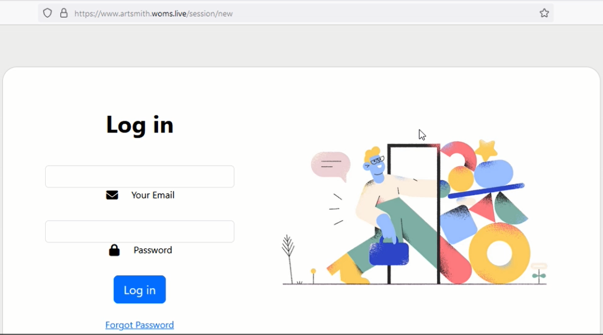
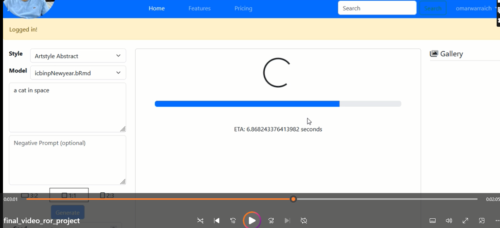
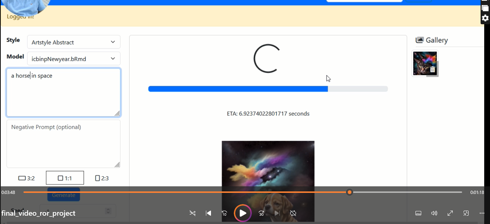
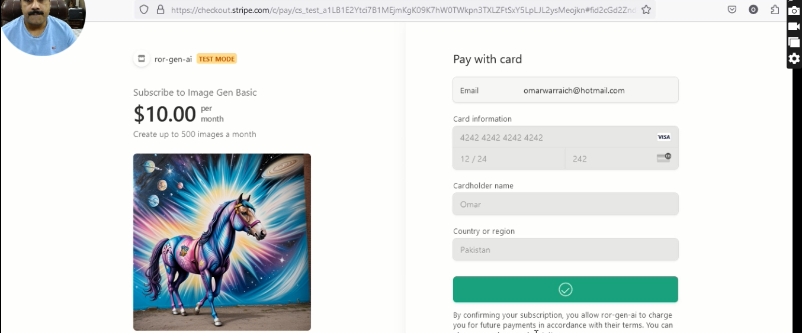

<!-- TABLE OF CONTENTS -->

# 📗 Table of Contents

- [📖 About the Project](#about-project)
  - [🛠 Built With](#built-with)
    - [Tech Stack](#tech-stack)
    - [Key Features](#key-features)
  - [🚀 Live Demo](#live-demo)
- [💻 Getting Started](#getting-started)
  - [Setup](#setup)
  - [Prerequisites](#prerequisites)
  - [Install](#install)
  - [Usage](#usage)
  - [Run tests](#run-tests)
  - [Deployment](#triangular_flag_on_post-deployment)
- [👥 Authors](#authors)
- [🔭 Future Features](#future-features)
- [🤝 Contributing](#contributing)
- [⭐️ Show your support](#support)
- [🙏 Acknowledgements](#acknowledgements)
- [❓ FAQ](#faq)
- [📝 License](#license)

<!-- PROJECT DESCRIPTION -->

# 📖 [Artsmith] <a name="about-project"></a>

## Project Description

Artsmith is a web application that allows users to generate art using a generative AI model. Users can create an account, purchase credits, and use those credits to generate art. The application also allows users to view their generated art and download it. The application is built using Ruby on Rails and integrates a generative AI model to generate art. The application also uses Stripe as a payment gateway to allow users to purchase credits. The generative AI model used in the application is StableDiffusion and both the model and the application are deployed on EC2 instances on AWS.

## 🖼 App Screenshot

<div style="display: flex; flex-wrap: wrap; gap: 10px;">
    
    
    
    
    
</div>

## 🛠 Built With <a name="built-with"></a>

### Tech Stack <a name="tech-stack"></a>

<details>
  <summary>Client</summary>
  <ul>
    <li><a href="https://rubyonrails.org/">RoR</a></li>
  </ul>
</details>

<details>
  <summary>Server</summary>
  <ul>
    <li><a href="https://rubyonrails.org/">Ruby on Rails</a></li>
  </ul>
</details>

<details>
<summary>Database</summary>
  <ul>
    <li><a href="https://www.postgresql.org/">PostgreSQL</a></li>
  </ul>
</details>

<!-- Features -->

### Key Features <a name="key-features"></a>

- **Generative AI Model Integration**
- **Custom User Authentication**
- **Stripe Payment Gateway**
- **Responsive Design**
- **Cloud Deployment Mastery**

<p align="right">(<a href="#readme-top">back to top</a>)</p>

<!-- LIVE DEMO -->

## 🚀 Live Demo <a name="live-demo"></a>

- Due to the expensive nature of a compute intensive generative model, we are unable to provide a live demo at this time. However, the link to the video demo is available below.

[Live Demo](https://youtu.be/HcN2TQhVp0Y)

<p align="right">(<a href="#readme-top">back to top</a>)</p>

<!-- GETTING STARTED -->

## 💻 Getting Started <a name="getting-started"></a>

To get a local copy up and running, follow these steps.

### Prerequisites

> ## Getting Started
>
> To get a local copy up and running follow these simple example steps.

### Prerequisites

- Have a computer and internet connection
- Have `Ruby` installed on your computer
- Have a basic knowledge of `Ruby` and `OOP` concept
- Have a general understanding of what testing is
- Have `visual-studio code` or any other code editor installed on your computer.

### Setup

- In order to get a copy of this project you need to download it from https://github.com/OmarMWarraich/ror-gen-ai.git
- Extract the zipped file and open it in your code editor

### Install

- Run the command bellow in your terminal to get all required files

```
bundle install
yarn
```

### Run Server

- Run the command bellow in your terminal
  bin/dev

### Run tests

you can run one of the following command in your terminal

1. Run testing

```Ruby
rspec spec
```

2. Run linters

```Ruby
> Rubocop --color
> Rubocop -A
```

## Author

👤 **Omar Warraich**

- GitHub: [@Omar Warraich](https://github.com/OmarMWarraich)
- Twitter: [@omarwarraich1](https://twitter.com/omarwarraich1)
- LinkedIn: [o-va](https://www.linkedin.com/in/o-va/)

## 🔭 Future Features

- Add Image to Image Generation

## 🤝 Contributing

Contributions, issues, and feature requests are welcome!

Feel free to check the [issues page](https://github.com/OmarMWarraich/ror-gen-ai.git/issues/).

## Show your support

Give a ⭐️ if you like this project!

<p align="right">(<a href="#readme-top">back to top</a>)</p>

<!-- ACKNOWLEDGEMENTS -->

## 🙏 Acknowledgments <a name="acknowledgements"></a>

I would like to thank Phil Smy for his guidance and support throughout the project.

<p align="right">(<a href="#readme-top">back to top</a>)</p>

## 📝 License

This project is [MIT](LICENSE) licensed.
